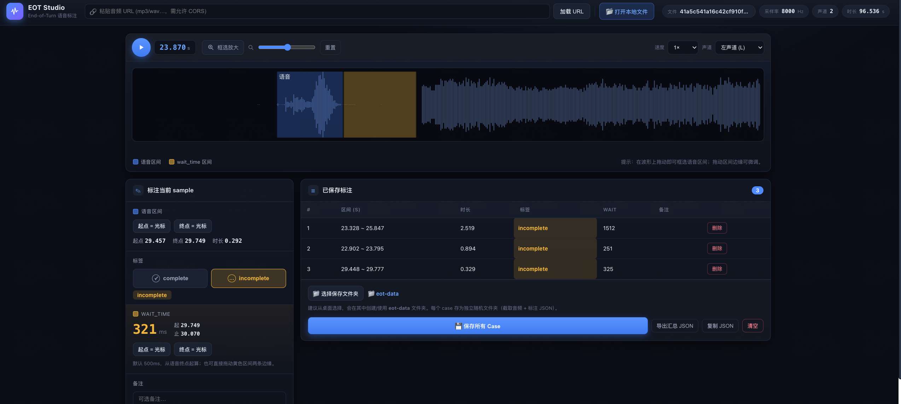

# End-of-Turn 标注工具

纯前端工具（无需后端）。上传音频 → 查看波形 → 标记 EOT 切点 → 选择 complete/incomplete → 若 incomplete 则在波形上拉取 wait_time。


## 运行

```bash
cd eot_annotator
./run.sh          # 启动本地服务在 http://localhost:8777
```

或手动：`python3 -m http.server 8777`，然后浏览器打开 http://localhost:8777

> 需要通过 http:// 打开（而非直接双击 file://），否则 ES module 无法加载。

## 使用步骤

1. **加载音频**：粘贴 URL（需允许跨域 CORS）或选择本地 mp3/wav。系统会解析文件头得到**真实采样率**（不受播放器内部重采样影响）并显示声道、时长。
2. **播放/缩放**：空格播放/暂停，可调速。点击波形移动光标。**缩放**：拖动缩放滑块，或点「🔍 框选放大」后在波形上拖出一段区域放大，「重置缩放」还原。**多声道文件**会出现「波形声道」选择器：选 `左声道/右声道` 后波形只显示该声道用于标注，但播放时该声道会同时送到左右两个喇叭（两边都能听到）；选 `立体声` 恢复原始。
3. **选择语音区间 (sample)**：在波形上**拖动**框选一段语音（起点~终点），或把光标移到目标位置点「起点=光标」「终点=光标」；可拖动蓝色区间的边缘微调。
4. **选择标签**：
   - `complete`：直接保存。
   - `incomplete`：出现黄色 **wait_time 区间**，**默认 500ms**（从语音终点起算），起点/终点都可调整——拖动黄色区间的两条边缘，或用「起点=光标」「终点=光标」按钮。`wait_time (ms)` 实时显示。
5. **保存标注**：点「保存这条标注」。可添加多条。
6. **保存 Case 到文件夹**：点「📁 选择保存文件夹」（建议从桌面选择），系统会在其中创建/使用 `eot-data` 文件夹。再点「💾 保存所有 Case 到文件夹」，**每一条标注会保存到一个随机命名的独立子文件夹**（如 `case-ab12cd34ef56/`），内含：
   - `audio.wav`：**截取好的语音段**（从语音起点到终点），并按标注的声道截取（左声道→左声道数据，右声道→右声道数据，立体声→双声道）。
   - `annotation.json`：标注数据，**记录该音频的采样率**、声道、区间、label、wait_time 等。
   > 需要 Chrome/Edge，并通过 `http://localhost` 打开（File System Access API）。也可「仅导出汇总 JSON / 复制 JSON」。

## 采样率检测

- MP3：解析帧头（跳过 ID3v2），支持 MPEG1/2/2.5。
- WAV：解析 `fmt ` chunk。
- 其它格式：回退用 AudioContext 解码（标记为"近似"）。

## Case 输出结构

```
eot-data/
  case-ab12cd34ef56/
    audio.wav          # 截取的语音段（选定声道）
    annotation.json
  case-9f0e1d2c3b4a/
    ...
```

`annotation.json` 示例：

```json
{
  "case_id": "case-ab12cd34ef56",
  "source_audio": "demo.mp3",
  "audio_file": "audio.wav",
  "sample_rate": 16000,
  "channel": "left",
  "clip": { "start_sec": 1.0, "end_sec": 2.0, "duration_sec": 1.0, "samples": 16000 },
  "label": "incomplete",
  "wait_time_ms": 600,
  "wait": { "start_sec": 2.0, "end_sec": 2.6, "rel_start_sec": 0.0, "rel_end_sec": 0.6 },
  "note": ""
}
```
音频截取到**语音终点**（模型在语音终点预测 `wait_time`），`wait_time_ms` 为预测目标；`rel_*` 是相对语音终点的时间。`complete` 时 `wait_*` 为 `null`。
